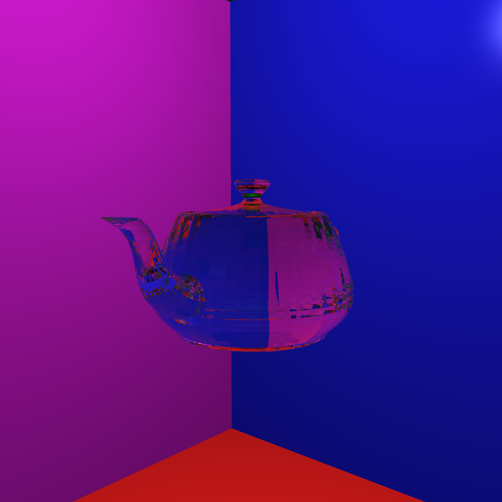
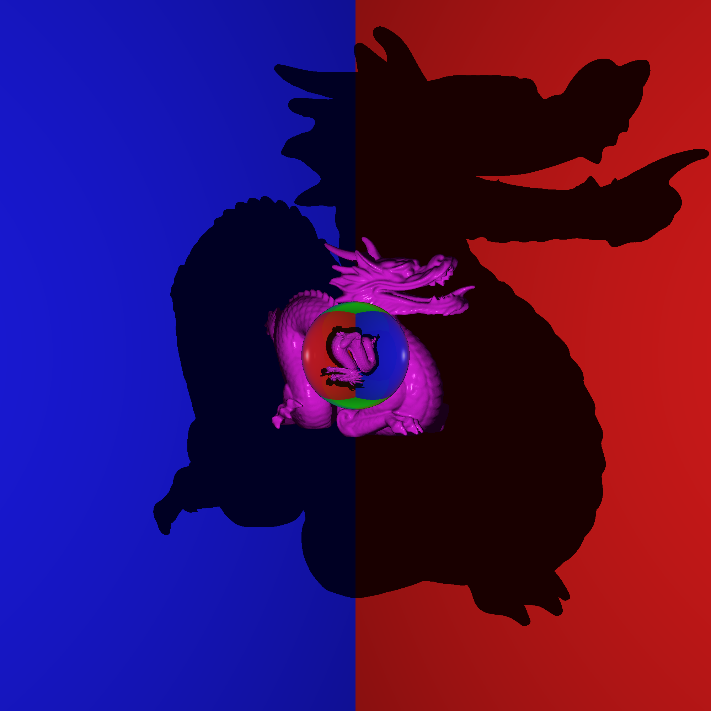
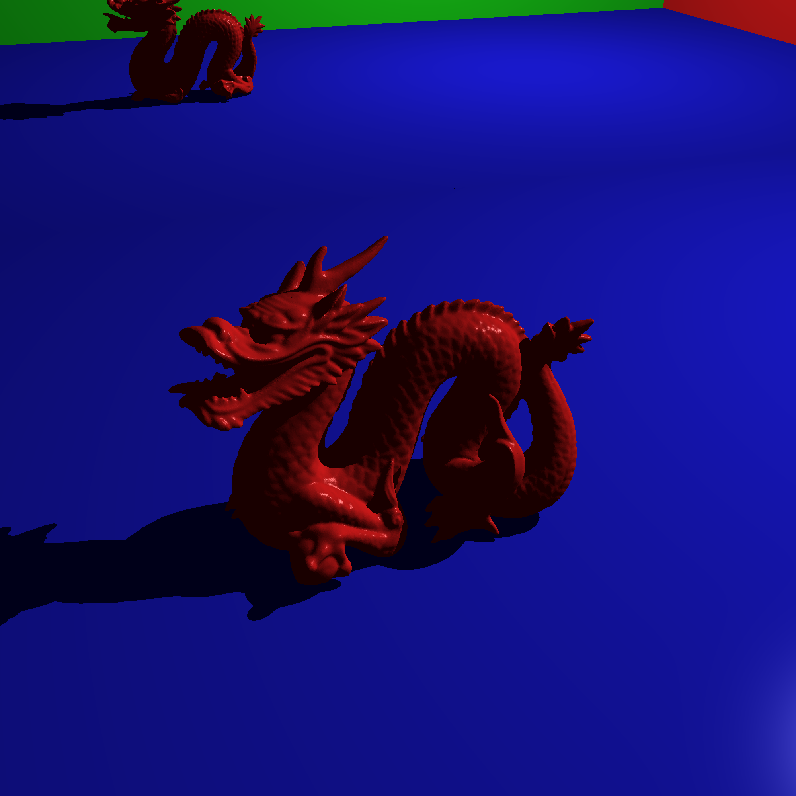
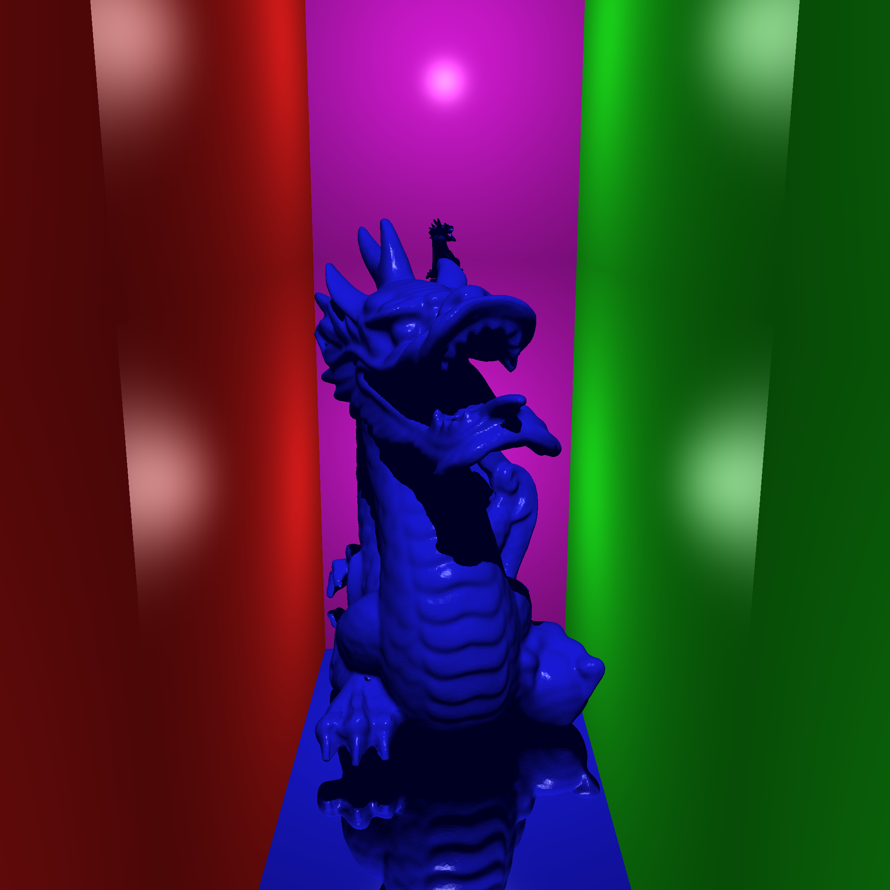

# Raytracer project
Fun raytracer I made in college to mess around with 3d models

# Eye Candy

Notice here how the glass sphere portrays everything through it upside down. This confirms the raytracer is physically accurate.

Dragon with mirror along the back wall

Scene with more complicated reflections. Mirrors on the floor and along the back wall.
